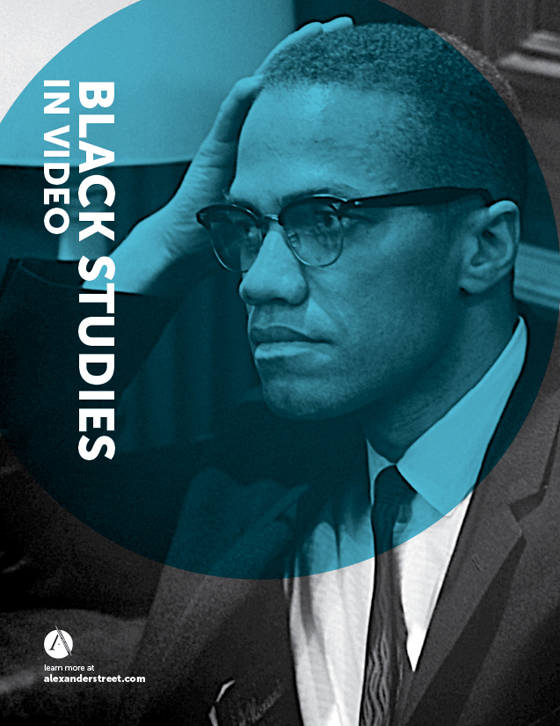

The Society of Typographic Arts is a Chicago based organization that has been active in Chicago since 1978. I think it would be an interesting topic to explore how students in Chicago have utilized different type-faces and fonts in their work. There is alot of information regarding the past shows and student classes throughout the archival records. Collaging different type-face and designs from past generations could help to establish a new form of communication between design language.

The Alexander Street webisite contains media with over 500 hours of archival footage of Black/African American documentaion. A short interpolated edit of footage could be an interesting way to navigate the culture, and ideologies of African Americans across time. Collaging footage atop of another to discover and create new dialouge throught the lens of modern technology. Rotoscoping, After Effects, and editing footage into a cohesive narrative.
