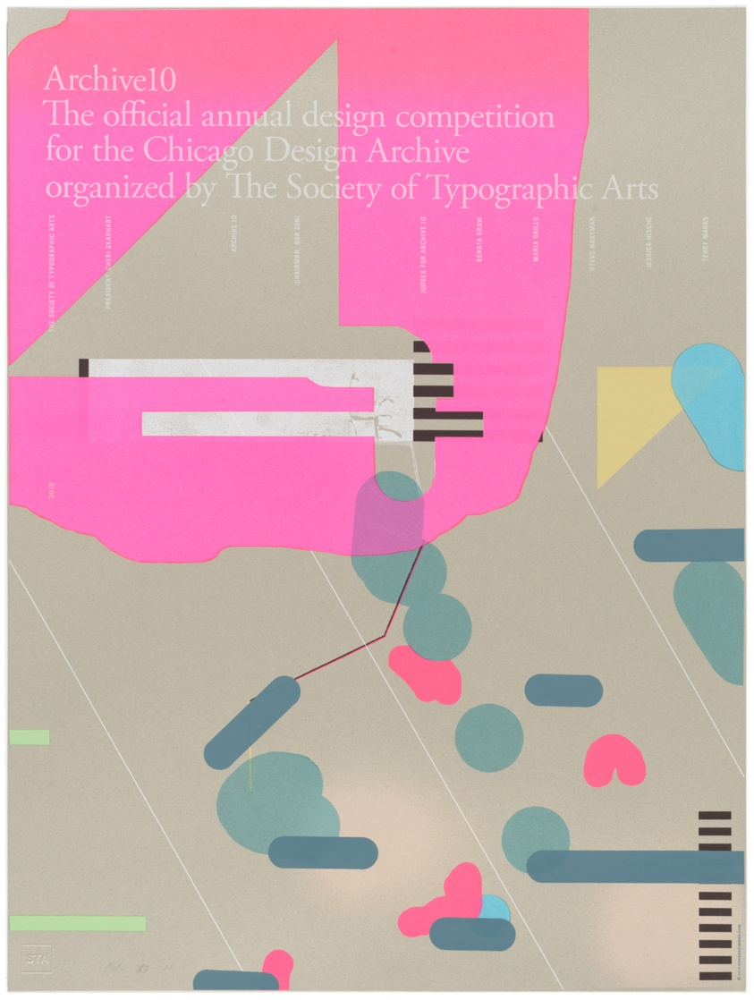

The Society of Typographic Arts is a Chicago based organization that has been active in Chicago since 1978. I think it would be an interesting topic to explore how students in Chicago have utilized different type-faces and fonts in their work. There is alot of information regarding the past shows and student classes throughout the archival records. Collaging different type-face and designs from past generations could help to establish a new form of communication between design language.
